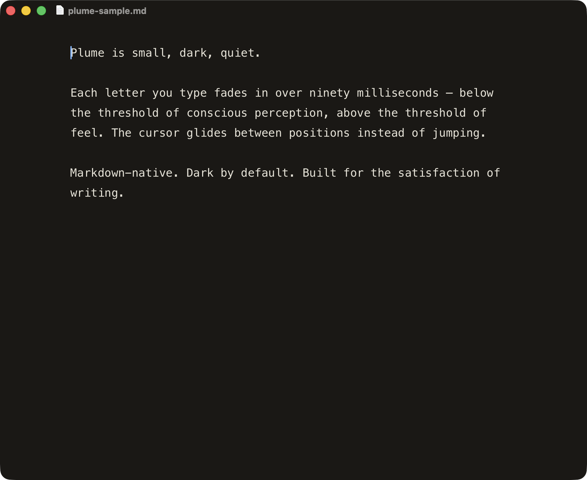

<div align="center">


<br>

[](https://github.com/zabrodsk/plume/releases/latest)
[](https://github.com/zabrodsk/plume/releases/latest/download/Plume.dmg)
[](LICENSE)
[](https://plume-md.pages.dev)

<br>

### [↓ Download for macOS](https://github.com/zabrodsk/plume/releases/latest/download/Plume.dmg) &nbsp;·&nbsp; [▶ Try it live](https://plume-md.pages.dev)

</div>

<br>

> *Writing should not feel like fighting your tools.*
>
> *What you focus on grows. So we let you focus.*
>
> *Less app. More page.*

<br>

<div align="center">



</div>

<br>

## How it feels

| | | |
|:---:|:---:|:---:|
| **90 ms** | **Sparkle** | **3 files** |
| Letter entrance | App updates | Source surface |
| **<4 MB** | **12+** | **100 %** |
| Universal binary | macOS supported | Open source · MIT |

<br>

## What's new in v3.0

Plume now opens **multiple files at once**, both as **tabs in one window**
and as **separate windows**. The brand still holds — *less app, more page* —
the chrome just learned to share.

- **Tabs**: ⌘T opens a new tab; ⌘1–⌘9 jump to it; ⇧⌘] / ⇧⌘[ cycle. Each
  tab keeps its own undo history, scroll, and selection.
- **Windows**: ⌘N opens a new window (was "New File" in v2 — now ⌘T does
  that). ⌘W closes the current tab, falling through to the window when
  the last tab goes.
- **Persistence**: your open windows and tabs come back on relaunch.
  Unsaved drafts survive a crash. Opt out with
  `defaults write com.zabrodsk.Plume plume.restoreWindowsOnLaunch -bool false`.
- **Binary size**: v2.7.2 measured ~636 KB universal, v3.0 measures
  ~948 KB. The old "under 300 KB" line in earlier ROADMAPs was set
  before Sparkle and SSH support landed; the realistic cap going
  forward is "under 1 MB universal" (about 470 KB per architecture).
  Tab strip, multi-tab state, Codable conformances, and JSON
  persistence account for the v2→v3 delta.

<br>

## Keyboard shortcuts

| Shortcut | Action |
|---|---|
| `⌘T` | New Tab |
| `⌘N` | New Window |
| `⌘O` | Open local file |
| `⌥⌘O` | Open file via SSH |
| `⌘S` | Save |
| `⇧⌘S` | Save As… |
| `⌘W` | Close Tab (or window if last tab) |
| `⇧⌘W` | Close Window |
| `⌘1`–`⌘9` | Jump to tab N |
| `⇧⌘]` / `⇧⌘[` | Next / previous tab |
| `⌃⇥` / `⌃⇧⇥` | Next / previous tab (alt) |
| `⌘F` | Find in page |
| `⌃⌘F` | Toggle full screen |
| `⌘?` | Open the cheatsheet (shows everything) |

<br>

## Install

**Pre-built** &nbsp;→&nbsp; download [`Plume.dmg`](https://github.com/zabrodsk/plume/releases/latest/download/Plume.dmg), drag `Plume.app` to `/Applications`. Notarized — opens with one click, no Gatekeeper warning. Future updates install through `Plume → Check for Updates…`. (Or grab [`Plume.zip`](https://github.com/zabrodsk/plume/releases/latest/download/Plume.zip) — same app, right-click → *Open* on first launch.)

**From source** &nbsp;→&nbsp;

```bash
git clone https://github.com/zabrodsk/plume.git
cd plume/src
./build.sh
open Plume.app
```

Requires macOS 12+ and the Swift toolchain (`xcode-select --install`).

**Homebrew** &nbsp;→&nbsp; we don't host a tap. A sample cask lives at [`dist/plume.rb`](dist/plume.rb) — copy it into [homebrew-cask](https://github.com/Homebrew/homebrew-cask) as a community PR if you'd like to maintain one.

<br>

## What's inside

```
src/
  main.swift     Cocoa shell — window, menu, file I/O (incl. SSH), updater, JS bridge
  index.html     Editor (dark mode), runs inside WKWebView
  icon.swift     Generates AppIcon.icns
  Info.plist     Bundle metadata
  build.sh       swiftc → lipo → iconutil → bundle → ad-hoc sign
dist/
  release.sh     Developer ID re-sign → DMG → notarize → staple → appcast
docs/
  index.html     Marketing landing page (the live demo)
  editor.html    Editor, web-embedded variant
.github/
  banner.svg     The hero you saw above
ROADMAP.md       v2 design notes — SSH and what stays out of scope
```

Two files of source. Read them at lunch.

<br>

## Why it feels different

Most editors render typed text instantly with a hard pixel pop. Plume's editor wraps the freshly-typed character in a `<span>` that animates from `opacity: 0.4` to `opacity: 1` over 90&nbsp;milliseconds, then merges back into a single text node when you stop typing. The result: every keystroke *blooms* onto the page, but the DOM stays clean and scrolling stays free even at 100&nbsp;KB documents.

Behind the scenes:

- **Cocoa + WKWebView** — the chrome is native (NSWindow, NSMenu, file panels); the editor is HTML/CSS/JS inside a web view. Best of both: native menus and shortcuts, web-grade animation precision.
- **Stable-text model** — incremental input diffing means each keystroke only mutates one DOM node. Paste 10&nbsp;KB and the render layer is still a single text node 140&nbsp;ms later.
- **Edit anywhere** — `File → Open via SSH…` (⌥⌘O) opens remote files over SSH using your existing keys and `~/.ssh/config`. Atomic writes, zero new auth surface, zero bundled dependencies.
- **Self-updating** — Sparkle checks the signed appcast and installs future releases from inside Plume.
- **Universal binary** — one `Plume.app`, runs natively on every Mac sold since 2012 (Apple Silicon and Intel).

<br>

## License

MIT. See [LICENSE](LICENSE). No telemetry. No account. No analytics. No friction.

<br>

<div align="center">

*Made with care.*

</div>
